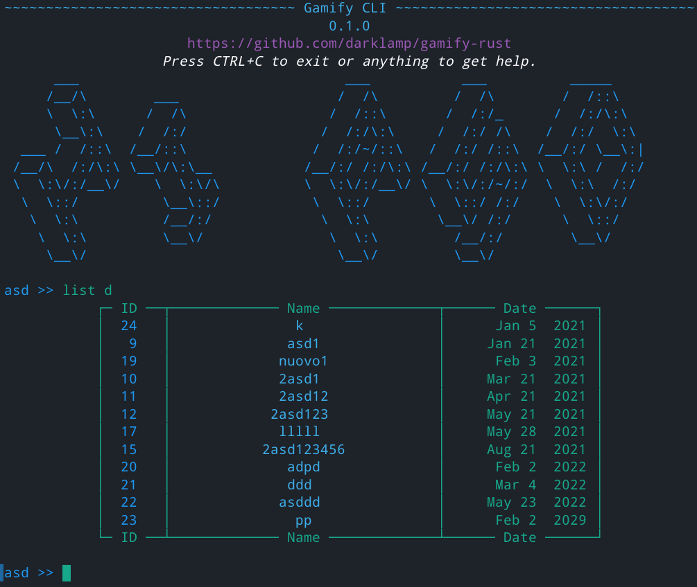

# gamify-rust

gamify-rust is a CLI interface for https://github.com/LudoLe/GamifyUser (university Data Bases 2 project) written in Rust.

## Implemented functionalities

admin: everything

user: none

